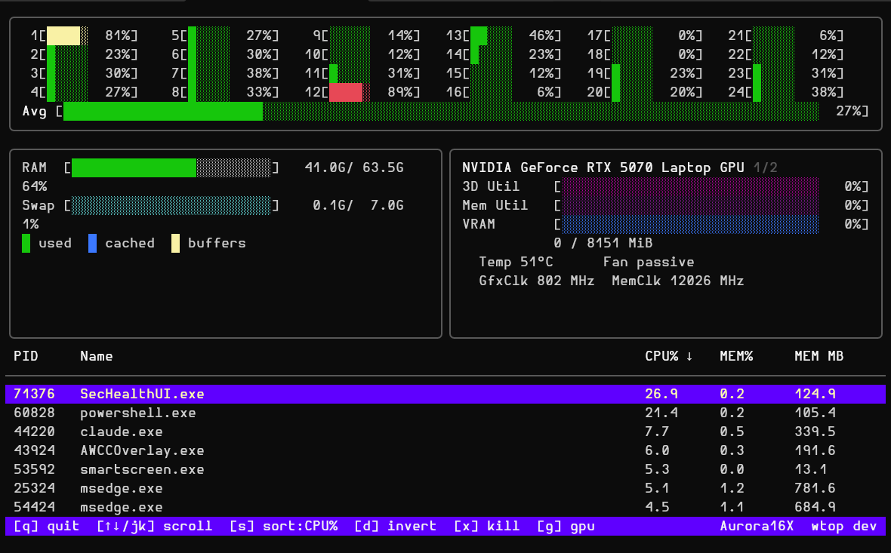

# `wtop`

[](https://github.com/michaelsanford/wtop/actions/workflows/ci.yml)
[](https://github.com/michaelsanford/wtop/actions/workflows/github-code-scanning/codeql)
[](https://github.com/michaelsanford/wtop/releases)
[](https://github.com/michaelsanford/wtop/releases)

[](go.mod)
[](https://github.com/michaelsanford/wtop/releases)
[](https://github.com/michaelsanford/wtop/releases)
[](https://github.com/michaelsanford/wtop/attestations)

[](LICENSE)

A self-contained, single-binary terminal system monitor for Windows, inspired by htop and written in Go.



## Features

- **CPU** — per-core utilisation bars with colour coding (green → yellow → red)
- **Memory** — RAM and swap bars in GiB
- **GPU** — best-effort: NVIDIA via `nvidia-smi`, AMD/Intel via PowerShell `Get-Counter`; loads in the background on startup so other panels appear immediately
- **Process list** — flat or htop-style tree view (`t`); sortable by CPU%, memory, PID, or name; kill selected process

## Keyboard shortcuts

| Key            | Action                                        |
|----------------|-----------------------------------------------|
| `q` / `Ctrl+C` | Quit                                          |
| `↑` / `↓`      | Scroll process list                           |
| `s`            | Cycle sort column (CPU% → MEM% → PID → Name)  |
| `d`            | Invert sort order                             |
| `t`            | Toggle tree view (htop-style parent → child)  |
| `x`            | Kill selected process (confirmation required) |
| `g`            | Cycle GPUs (if multiple)                      |

## Download

Grab the latest binary from the [Releases](../../releases) page. No installer needed — just run it.

```powershell
.\wtop.exe
```

## Build from source

Requires Go 1.26+.

```powershell
go build -o wtop.exe ./cmd/wtop/
```

## Supply chain security

Every release includes:

- **CycloneDX SBOM** (`wtop-vX.Y.Z-sbom.cdx.json`) — full dependency inventory
- **Cosign bundle** (`*.bundle`) — keyless signature via Sigstore
- **GitHub build provenance attestation** — verifiable via `gh attestation verify`

Verify a release binary:

```sh
gh attestation verify wtop-v0.1.0-windows-amd64.exe --repo michaelsanford/wtop
```

`Verify-Release.ps1` automates all three checks against the latest release:

```powershell
❯ .\Verify-Release.ps1

Checking prerequisites
────────────────────────────────────────────────────────────
  [PASS] gh
  [PASS] cosign (cosign-windows-amd64)
  [PASS] cyclonedx-cli (schema validation enabled)

Fetching release metadata
────────────────────────────────────────────────────────────
  [PASS] Release: v1.1.0  (5 assets)

Downloading assets to downloads/
────────────────────────────────────────────────────────────
         Cached:     wtop-v1.1.0-sbom.cdx.json
         Cached:     wtop-v1.1.0-windows-amd64.exe
         Cached:     wtop-v1.1.0-windows-amd64.exe.bundle
         Cached:     wtop-v1.1.0-windows-arm64.exe
         Cached:     wtop-v1.1.0-windows-arm64.exe.bundle
  [PASS] All assets ready

1/3  GitHub Attestation  (gh attestation verify)
────────────────────────────────────────────────────────────
         Subject: wtop-v1.1.0-windows-amd64.exe
  [PASS] wtop-v1.1.0-windows-amd64.exe
         Subject: wtop-v1.1.0-windows-arm64.exe
  [PASS] wtop-v1.1.0-windows-arm64.exe

2/3  Cosign Keyless Signature  (cosign-windows-amd64 verify-blob)
─────────────────────────────────────────────────────────────────
         Certificate identity: https://github.com/michaelsanford/wtop/.github/workflows/release.yml@refs/tags/v1.1.0
         OIDC issuer:          https://token.actions.githubusercontent.com
         Subject: wtop-v1.1.0-windows-amd64.exe
  [PASS] wtop-v1.1.0-windows-amd64.exe
         Subject: wtop-v1.1.0-windows-arm64.exe
  [PASS] wtop-v1.1.0-windows-arm64.exe

3/3  SBOM Integrity  (CycloneDX JSON)
────────────────────────────────────────────────────────────
         File: wtop-v1.1.0-sbom.cdx.json
  [PASS] Valid JSON
  [PASS] bomFormat = CycloneDX
  [PASS] specVersion = 1.6
  [PASS] metadata.component.version = v1.1.0
  [PASS] 23 dependency components listed
  [WARN] 23 of 23 components lack license data
         Running: cyclonedx validate
  [PASS] cyclonedx-cli schema validation

Summary  —  v1.1.0
────────────────────────────────────────────────────────────
  [PASS] GitHub Attestation (gh attestation verify)
  [PASS] Cosign Signature   (cosign verify-blob)
  [PASS] SBOM Integrity     (CycloneDX)

  Release v1.1.0 passed all verification checks.
```

## License

MIT
